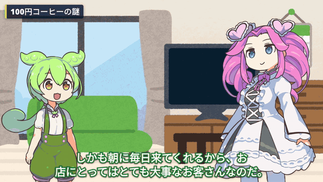
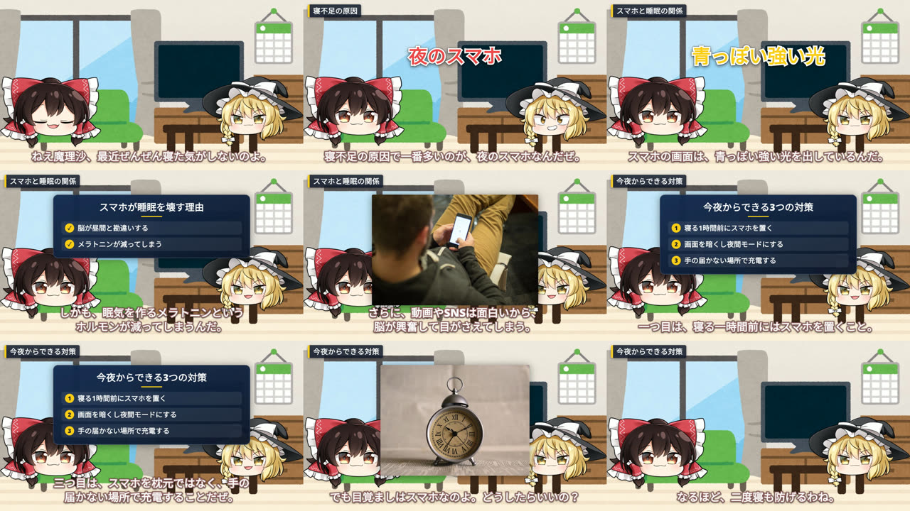
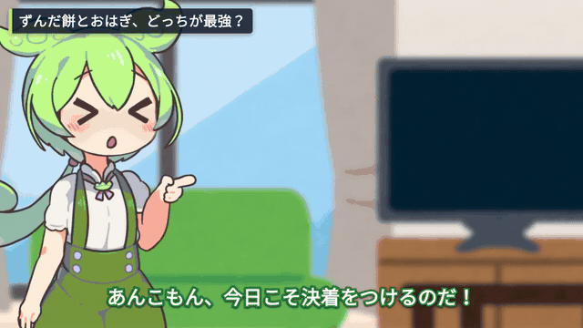
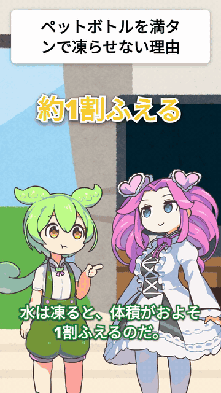
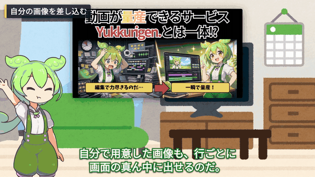
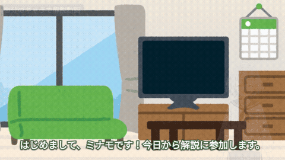

# YukkuriGen — AI から使う「ゆっくり解説」動画生成

台本（話者＋セリフの配列）を渡すと、**MP4** が返る。こちらで音声を合成してから
本番レンダーを開始する（5クレジット・有料プラン）。`output:"preview"` なら
1クレジット・低解像度・20秒で、**無料プランでも動くものが見られる**。
人が編集画面で作ることは想定していない——**あなたが自分の AI に頼み、その AI が
ここを呼ぶ。**

```
あなた「ゆっくり解説で、日本の年金制度の動画を作って」
  → AI が create_yukkuri_video を呼ぶ（数秒で jobId が返る）
  → AI が get_job で音声合成とレンダー開始を待ち、get_render で MP4 の完成を待つ
  → MP4 の URL が返る
あなた「3行目をもっと驚いた感じに」
  → AI が update_lines でその行だけ直す（喋る速さは render_mp4 の voicePlaybackRate で焼き直す）
```

直すのもこのサイトではなく、AI との会話で行う。

## 作例

台本は AI（Claude）が書いて MCP で渡し、返ってきた MP4 をそのまま載せている（人の手直し無し。2026-09-26 に撮り直し）。
台本は 21 行と 22 行。図解カード・写真・章の見出し・強調テロップ、**行ごとの表情とポーズ**も、台本を書いた AI が指定している
（`card` / `photo` / `chapter` / `emphasis` / `emotion` / `pose`）。YukkuriGen はそれを画像にして焼くだけで、サーバで AI は呼ばない。
音声・字幕・立ち絵・BGM・効果音は YukkuriGen が入れる。

立ち絵は目・眉・口・顔色・汗や涙・腕が別々の部品なので、セリフごとに組み替える。
表情は16種（ドヤ顔・ジト目・ガーン・照れ・大喜び など。全キャラ共通）、ポーズ（指さし・腕組み・マイク など）は
ずんだもん・四国めたん・春日部つむぎ・あんこもんで使える。
聞き手も、直前に話したときの表情を穏やかにして残す。写真や図解が出ている間は、キャラが少し外へ寄って顔を空ける。

**ずんだもん・四国めたん「コンビニコーヒーが安い本当の理由」**



→ [MP4 をダウンロード（720p・約96秒・音あり・6.7MB）](https://github.com/yukkurigen/yukkurigen-mcp/raw/main/samples/zunda.mp4)

**霊夢・魔理沙「寝る前のスマホが睡眠を壊す理由」**



→ [MP4 をダウンロード（720p・約82秒・音あり・5.2MB）](https://github.com/yukkurigen/yukkurigen-mcp/raw/main/samples/yukkuri.mp4)

頼み方の例:

> ずんだもんとめたんで、コンビニコーヒーが安い理由を1分半くらいで解説して。最後にチャンネル登録を呼びかけて。

AI は台本の行に、たとえば次のように演出も書いて `create_yukkuri_video` を呼ぶ:

```json
{"speaker":"zundamon","text":"安くできる理由は三つあるのだ。",
 "card":{"title":"安くできる3つの理由","style":"steps","items":["豆をまとめて大量仕入れ","ボタンひとつで自動抽出","お客さんのセルフ式"],"span":4},
 "emotion":"smug","pose":"hip"}
{"speaker":"metan","text":"味は大丈夫なのかしら？","photo":["coffee beans","coffee"],"emotion":"troubled","pose":"hold"}
{"speaker":"metan","text":"えっ、儲からなくてもいいってこと！？","emotion":"shocked","pose":"mouth_cover","cameraMode":"dynamic"}
```

`get_render` で完成した MP4 の URL と、
YouTube の概要欄に貼るクレジット（`credits`）が返る。作例のクレジット:

```
【使用素材】
音声: VOICEVOX:ずんだもん、VOICEVOX:四国めたん
立ち絵: 坂本アヒル 様
背景: いらすとや 様（https://www.irasutoya.com/）
BGM: DOVA-SYNDROME（https://dova-s.jp/）、こおろぎ 様
効果音: 効果音ラボ（https://soundeffect-lab.info/）
写真: Openverse（CC0・パブリックドメイン）
制作: YukkuriGen（https://yukkurigen.com/）
```

VOICEVOX の音声は「VOICEVOX:キャラ名」の表記が利用条件。動画を投稿するときは、この
クレジットを概要欄に入れること（YukkuriGen から YouTube へ投稿した場合は自動で入る）。
写真は Openverse で CC0・パブリックドメインのものだけを使っている。

### 機能ごとの作例とスキル

[`skills/`](./skills) に、機能ごとのスキル（AI 向けの手順書）が10本ある。Claude Code ならプラグインとしてまとめて入る（下の「つなぐ」）。
作例は、どれも AI（Claude）が MCP で作って焼いたものをそのまま載せている（2026-09-26）。

| スキル | できること | 作例 |
|---|---|---|
| [yukkuri-video-basics](skills/yukkuri-video-basics/SKILL.md) | 台本から1本作る（霊夢・魔理沙） | [MP4](https://github.com/yukkurigen/yukkurigen-mcp/raw/main/samples/yukkuri.mp4) |
| [dialogue-25d](skills/dialogue-25d/SKILL.md) | ずんだもん×あんこもんの掛け合い。立ち絵が 2.5D で呼吸し、体・しっぽ・頭の飾りが揺れる |  [MP4](https://github.com/yukkurigen/yukkurigen-mcp/raw/main/samples/dialogue-25d.mp4) |
| [explainer-visuals](skills/explainer-visuals/SKILL.md) | 図解カード・写真・章の見出し・強調テロップ |  [MP4](https://github.com/yukkurigen/yukkurigen-mcp/raw/main/samples/zunda.mp4) |
| [expressions-poses](skills/expressions-poses/SKILL.md) | 表情16種・腕のポーズを行ごとに | [一覧（画像）](samples/expressions.jpg) |
| [vertical-shorts](skills/vertical-shorts/SKILL.md) | 縦型ショート（9:16）。上にタイトル・素材、下にキャラ2人・字幕 |  [MP4](https://github.com/yukkurigen/yukkurigen-mcp/raw/main/samples/vertical-shorts.mp4) |
| [your-images](skills/your-images/SKILL.md) | 自分の画像を行ごとに好きな位置・大きさで出す／背景を差し替える |  [MP4](https://github.com/yukkurigen/yukkurigen-mcp/raw/main/samples/your-images.mp4) |
| [batch-production](skills/batch-production/SKILL.md) | 最大20本を1回でまとめて作る | [3本の例（画像）](samples/batch.jpg) |
| [review-and-fix](skills/review-and-fix/SKILL.md) | 焼く前に共有リンクで見せ、指定の行だけ直す（消費なし） | [共有リンクの画面](samples/review-share.jpg) |
| [own-character](skills/own-character/SKILL.md) | 自分のキャラ（PSD・PNG）を話者にする。画像生成 AI で作ったキャラも PSD にすれば喋る |  [MP4](https://github.com/yukkurigen/yukkurigen-mcp/raw/main/samples/own-character.mp4) [PSD の見本](samples/minamo.psd) |
| [youtube-upload](skills/youtube-upload/SKILL.md) | 焼いた動画を自分の YouTube へ投稿（既定は非公開） | — |

アカウントの無いまま呼ぶと、会員登録（無料・月10クレジット）の URL 付きで `signup_required` が返る。
ChatGPT・claude.ai のコネクタなら、つなぐ時に登録と許可の画面が開く。

## つなぐ

### ChatGPT・claude.ai（コネクタ）

コネクタの追加で、この URL を入れるだけ。鍵は要らない:

```
https://app.yukkurigen.com/api/mcp
```

YukkuriGen の許可画面が開くので「許可する」を押す（OAuth 2.1・PKCE・動的クライアント登録）。
つないだアプリは https://app.yukkurigen.com/settings/api-keys に「<アプリ名>（OAuth）」として出て、
そこから取り消せる。

### 鍵をヘッダーで渡すクライアント

まず鍵を取る（無料・月10クレジット）:
https://app.yukkurigen.com/settings/api-keys

### Claude Code

プラグインとして入れると、MCP サーバの接続と機能ごとのスキル10本がまとめて入る（接続はブラウザでの許可）:

```
/plugin marketplace add yukkurigen/yukkurigen-mcp
/plugin install yukkurigen@yukkurigen
```

API キーで繋ぐなら:

```bash
claude mcp add --transport http yukkurigen https://app.yukkurigen.com/api/mcp \
  -H "Authorization: Bearer $YUKKURIGEN_API_KEY"
```

チームで共有するなら、このリポジトリの `.mcp.json` をプロジェクトに置く。
鍵は環境変数 `YUKKURIGEN_API_KEY` から読む（ファイルに鍵を書かない）。

### Codex

`~/.codex/config.toml` に足す:

```toml
[mcp_servers.yukkurigen]
url = "https://app.yukkurigen.com/api/mcp"
bearer_token_env_var = "YUKKURIGEN_API_KEY"
```

```bash
export YUKKURIGEN_API_KEY=yg_live_...
```

鍵は環境変数から読むので、設定ファイルに書かない。

### Gemini CLI

```bash
export YUKKURIGEN_API_KEY=yg_live_...
gemini extensions install https://github.com/yukkurigen/yukkurigen-mcp
```

このリポジトリの `gemini-extension.json` が読まれる。鍵は環境変数から読むので、
ファイルに書かない。

### その他の MCP クライアント

エンドポイントは1つだけ:

```
POST https://app.yukkurigen.com/api/mcp
Authorization: Bearer <API key>
```

JSON-RPC 2.0 over HTTP。`tools/list` でツール一覧が取れる。
`server.json` は MCP レジストリ用のマニフェスト。

### REST で直接叩く

```bash
curl -X POST https://app.yukkurigen.com/api/v1/agent/generate \
  -H "Authorization: Bearer $YUKKURIGEN_API_KEY" \
  -H "Content-Type: application/json" \
  -H "Idempotency-Key: my-first-video-sync" \
  -d '{"title":"テスト","script":[{"speaker":"reimu","text":"こんにちは"},{"speaker":"marisa","text":"よろしくだぜ"}]}'
```

これは同期の呼び出しで、音声合成とレンダー開始を待ってから返る（台本が長いと数十秒。
サーバの設定によっては、一定時間だけ待って終わらなければ 202 が返る）。
待っている途中で接続が切れても、サーバ側では生成と課金が進む。投げ直すときは同じ `Idempotency-Key` を付ける
（同じ鍵なら、処理中は 409、終わっていれば最初の結果が返り、2本目は作られない）。
待たずに済ませるなら `Prefer: respond-async` を付ける。数秒で 202 と `jobId` / `projectId` が返る
（サーバの設定によってはジョブにならず、同期で待ってから 200 が返る）:

```bash
curl -X POST https://app.yukkurigen.com/api/v1/agent/generate \
  -H "Authorization: Bearer $YUKKURIGEN_API_KEY" \
  -H "Content-Type: application/json" \
  -H "Prefer: respond-async" \
  -H "Idempotency-Key: my-first-video" \
  -d '{"title":"テスト","script":[{"speaker":"reimu","text":"こんにちは"},{"speaker":"marisa","text":"よろしくだぜ"}]}'
```

`GET /api/v1/jobs/{jobId}` が `succeeded` になったら、`result.renderId` を
`GET /api/v1/projects/{projectId}/render/{renderId}/progress` に渡して完成を待つ。
`failed` なら `error.code` に理由が入り、クレジットは返金される。
例外は、レンダーを起動したあとにジョブだけが失敗した場合（まれ）で、レンダーは課金されたまま
動いていて返金されず、Idempotency-Key も空かない（同じ鍵で投げ直すと、起動済みのレンダーが 200 で
返り、2本目は作られない）。`renderId` に `agent-{jobId}` を渡して進捗を見れば結果が分かる
（`not_found` なら起動しておらず、返金される）。

複数本は `POST /api/v1/agent/generate/batch`（MCP は `create_yukkuri_videos_batch`、最大20件）にまとめて渡せる。
`Prefer: respond-async` を付けると数秒で 202 と `jobId` が返り、各件はサーバ側で1件ずつ順に作られる
（サーバの設定によってはジョブにならず、同期で処理して 200 が返る。MCP のツールは自分で付ける）。
`succeeded` の `result.results` に各件の `projectId` / `renderId` / `jobId` が並ぶので、`renderId` を
上と同じ進捗の URL に渡す。バッチのジョブが `failed` になっても**返金ではない**——作り始めた件は
それぞれのジョブで課金されたまま進む。失敗したバッチは `GET /api/v1/jobs/{jobId}` の `partialResults` に
作り始めた件と投げ直してよい件（`resendIndexes`）が分かれて入るので、その件だけを新しい
`idempotencyKeyPrefix` の新しいバッチで送る。同じ prefix で全件を投げ直しても作り始めた件が二重に
作られないのは、その件のジョブが終わってから 24 時間以内だけ（期限は `partialResults.fullResendSafeUntil`）。

全項目の定義: https://app.yukkurigen.com/openapi.json

## AI に読ませるもの

**[SKILL.md](./SKILL.md)** が手順書のすべて。接続、最小例、立ち絵、カメラ、素材の位置、縦型、
テンプレートの位置の直し方、クレジット、402 を受けたときの購入導線、冪等キー、バッチ生成、コールバックまで。
`app.yukkurigen.com/skill.md` と同一のファイルで、CI で一致を検査している。
機能ごとに短く分けたものが [`skills/`](./skills)（上の表）。

## できること / かかるもの

| | クレジット | 無料枠で |
|---|---|---|
| 台本を作る・読む・直す・音声を作る | 0 | ○ |
| MP4 プレビュー（低解像度・指定行の周辺だけ） | 1 | ○（月10回） |
| MP4 本番レンダー | 5 | × 有料プラン |

無料枠は月10クレジット。402 を受けたら `create_checkout` で決済リンクを出せる
——会話を止めずに購入まで進める。

同時に走らせられるレンダーはプランごとに上限がある（無料1 / スタンダード3 /
プロ10）。超えると `429 too_many_concurrent_renders`（課金なし）。

## 正直に言っておくこと

- **`create_yukkuri_video`（ジョブで受け付ける形）から MP4 までは、2026-09-25 に本番で通した**
  （OAuth で接続 → `create_yukkuri_video` → `get_job` → `get_render` の完成まで。上の作例がその出力）。
  まとめて作るバッチ（`create_yukkuri_videos_batch`）は 2026-09-26 に本番で**プレビュー出力（1クレジット）の3本**を最後まで通した。**MP4 出力のバッチは本番未検証**（本番で最後まで通した実績はまだ無い）。
  初めての形の台本は少数の行で試してほしい。途中で止まる場合は段ごとに切り分けられる
  （`get_project` → `generate_audio` → `render_mp4`）。不具合として報告してほしい。
- **こちらのサーバは AI（LLM）を呼ばない。** 台本・図解・写真の検索語・章・強調を決めるのは、
  あなたが使っている AI（ChatGPT・Claude などのあなたのサブスク）。こちらは音声合成・画像化・写真の検索
  （Openverse の CC0・パブリックドメインのみ）・レンダーだけを行う。指定の無い行には図解や写真は出ない。
- **`.ymmp`（YMM4 プロジェクト）の書き出しは 2026-09-07 に撤去した。** 音声も
  立ち絵も相手の YMM4 が作る形で、こちらの音声合成を一度も通らなかった——
  代替が容易なわりに、保守する面だけが増えていた。MP4 一本にした。
- **OAuth は 2026-09-24 に入れた。** RFC 9728 の `authorization_servers` と
  RFC 8414 のメタデータを出している。発行されるアクセストークンは API キーそのもので、
  期限は無く refresh_token も出さない（取り消しは鍵の画面で）。本番で登録→許可→
  トークン交換→`tools/list` まで通したが、ChatGPT・claude.ai の実際の画面からの接続は
  こちらではまだ試していない。つながらなければ報告してほしい。
- MP4 の完了通知（`callbackUrl`）は、こちら側が「終わったこと」を確定させた
  時点で送る。誰もポーリングしていない場合は掃除の巡回まで待つ。急ぐなら
  `get_render` を1〜2回叩けばその場で確定する。

## リンク

- [ヘルプセンター](https://help.yukkurigen.com/)
- [自分の AI につなぐ](https://help.yukkurigen.com/connect-your-ai)
- [料金](https://yukkurigen.com/pricing)
- [OpenAPI](https://app.yukkurigen.com/openapi.json)
- [llms.txt](https://app.yukkurigen.com/llms.txt)

## ライセンス

[MIT](./LICENSE)。**このリポジトリの中身（接続情報・マニフェスト・文書）に
対するライセンスであって、YukkuriGen のサービス本体には及ばない。**
サービスの利用条件は[利用規約](https://yukkurigen.com/terms)による。
